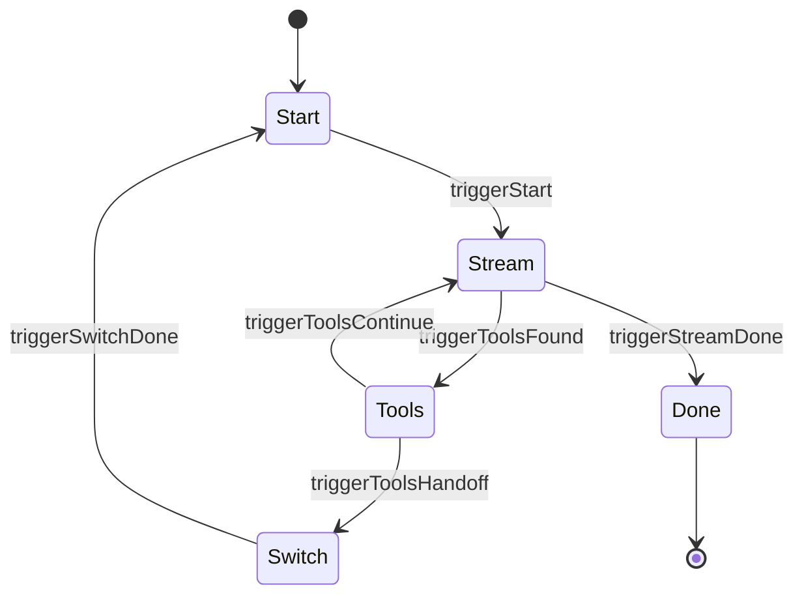

# Engine State Machine

```mermaid
stateDiagram-v2
    [*] --> Start
    Start --> Stream : triggerStart
    Stream --> Tools : triggerToolsFound
    Stream --> Done : triggerStreamDone
    Tools --> Stream : triggerToolsContinue
    Tools --> Switch : triggerToolsHandoff
    Switch --> Start : triggerSwitchDone
    Done --> [*]
```
