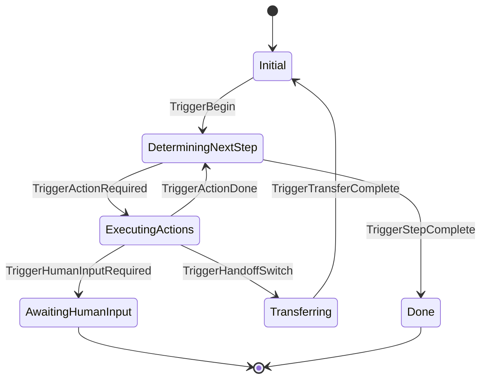

# Engine State Machine

```mermaid
stateDiagram-v2
    [*] --> Initial
    Initial --> DeterminingNextStep : TriggerBegin
    DeterminingNextStep --> ExecutingActions : TriggerActionRequired
    DeterminingNextStep --> Done : TriggerStepComplete
    ExecutingActions --> DeterminingNextStep : TriggerActionDone
    ExecutingActions --> Transferring : TriggerHandoffSwitch
    ExecutingActions --> AwaitingHumanInput : TriggerHumanInputRequired
    Transferring --> Initial : TriggerTransferComplete
    AwaitingHumanInput --> [*]
    Done --> [*]
```
